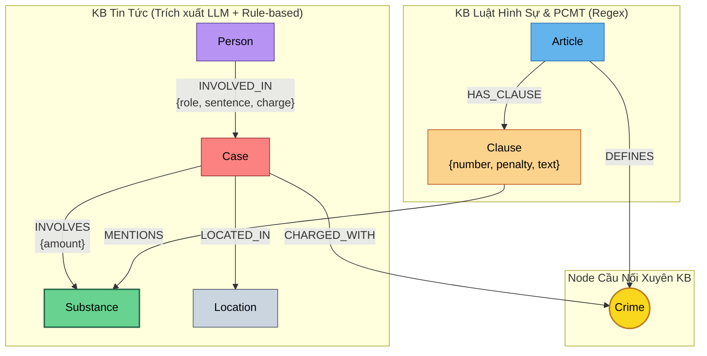

# Thiết kế Ontology — Day 19 Knowledge Graph

**Họ tên:** Nguyễn Đức Phát  
**MSSV:** 2A202602753  
**Ngày:** 05/10/2026  

**Lựa chọn:**
- [x] Tự thiết kế (xét bonus +15, xem `SUBMISSION.md`)

---

## 1. Sơ đồ

Hệ thống Knowledge Graph tích hợp 2 Cơ sở Tri thức (Knowledge Base - KB): **KB Luật** (`data/drug_law/`) và **KB Tin tức** (`data/drug_news/`). Node cầu nối trung tâm là **`Crime`** (Tội danh) và cầu nối phụ trợ định lượng là **`Substance`** (Chất ma túy).

---

## 2. Entity types (Node labels)

| Label | Ý nghĩa | Khóa định danh (`MERGE` theo) | Properties | Lấy từ KB nào | Trích bằng |
| --- | --- | --- | --- | --- | --- |
| **`Article`** | Điều luật trong BLHS hoặc Luật PCMT | `id` (ví dụ: `"Điều 251 BLHS"`) | `id`, `title`, `law`, `doc_id` | Luật | Regex |
| **`Clause`** | Khoản cụ thể trong Điều luật quy định khung hình phạt | `id` (ví dụ: `"Điều 251 BLHS khoản 1"`) | `id`, `number`, `penalty`, `text`, `doc_id` | Luật | Regex |
| **`Crime`** | Tội danh hình sự chuẩn hóa (Node cầu nối chính) | `name` (chuẩn hóa thường, không tiền tố "Tội") | `name` | Cả hai | Luật (regex) + Tin tức (LLM + `link_entity`) |
| **`Substance`** | Tên chất ma túy / tiền chất chuẩn hóa (Cầu nối định lượng) | `name` (ví dụ: `"MDMA"`, `"Heroine"`, `"Ketamine"`) | `name`, `aliases` | Cả hai | Luật (keyword matching) + Tin tức (LLM & regex) |
| **`Case`** | Vụ án / chuyên án ma túy được báo chí phản ánh | `name` (tên vụ việc) | `name`, `summary`, `date`, `doc_id`, `source_title` | Tin tức | LLM |
| **`Person`** | Đối tượng liên quan (bị cáo, bị can, giang hồ, cán bộ) | `name` (họ và tên đối tượng) | `name`, `aliases`, `doc_id` | Tin tức | LLM |
| **`Location`** | Tỉnh / thành phố nơi xảy ra vụ án hoặc xét xử | `name` (ví dụ: `"TP.HCM"`, `"Hà Nội"`) | `name` | Tin tức | LLM |

---

## 3. Relationships

| Type | Từ → Đến | Properties trên cạnh | Ý nghĩa |
| --- | --- | --- | --- |
| **`DEFINES`** | `Article` → `Crime` | *(không có)* | Điều luật quy định và định nghĩa tội danh hình sự tương ứng. |
| **`HAS_CLAUSE`** | `Article` → `Clause` | *(không có)* | Điều luật phân tách thành các khoản chứa cấu thành và khung hình phạt cụ thể. |
| **`MENTIONS`** | `Clause` → `Substance` | *(không có)* | Khoản luật quy định định lượng hoặc tình tiết liên quan đến chất ma túy cụ thể. |
| **`CHARGED_WITH`** | `Case` → `Crime` | *(không có)* | Vụ án bị khởi tố, truy tố hoặc xét xử theo tội danh nào. |
| **`INVOLVES`** | `Case` → `Substance` | `amount` (ví dụ: `"hơn 9,6kg"`, `"36kg"`) | Tang vật ma túy bị thu giữ hoặc liên quan đến vụ án. |
| **`LOCATED_IN`** | `Case` → `Location` | *(không có)* | Địa bàn thực hiện hành vi phạm tội hoặc cơ quan xét xử thụ lý vụ án. |
| **`INVOLVED_IN`** | `Person` → `Case` | `role` (vai trò), `charge` (tội danh), `sentence` (mức án) | Cá nhân tham gia vào vụ án với tư cách tố tụng và mức án cụ thể. |

---

## 4. Node cầu nối giữa 2 KB

- **Node nào:** **`Crime`** (Tội danh) là node cầu nối chính; **`Substance`** (Chất ma túy) là node cầu nối bổ trợ.
- **Vì sao chọn node này:**
  - Trong tin tức báo chí, phóng viên luôn nêu rõ hành vi hoặc tội danh bị khởi tố/xét xử (ví dụ: *"mua bán trái phép chất ma túy"*, *"tổ chức sử dụng trái phép chất ma túy"*) và tang vật (ví dụ: *MDMA, Ketamine*), nhưng hầu như không nhắc đến số hiệu Điều luật hay cấu trúc khoản.
  - Trong Bộ luật Hình sự Chương XX, mỗi Điều luật tương ứng trực tiếp với một Tội danh xác định (`Article -[:DEFINES]-> Crime`), và các Khoản định khung tăng nặng dựa trên loại chất và khối lượng tang vật (`Clause -[:MENTIONS]-> Substance`).
  - Do đó, `Crime` là thực thể duy nhất có thể liên kết trực tiếp ngữ cảnh hành vi từ tin tức sang căn cứ pháp lý của luật.
- **Cách đảm bảo hai phía khớp tên:**
  1. **Chuẩn hóa chuỗi (`normalize_crime`):** Bỏ tiền tố `"tội "`, chuẩn hóa khoảng trắng thừa, chuyển về chữ thường, loại bỏ các ký tự trích dẫn (`"`, `'`, `“`, `”`).
  2. **Thư viện đối sánh mờ (`link_entity`):** Thực hiện khớp chính xác (exact match) trên dạng chuẩn hóa trước; nếu không khớp, dùng `difflib.get_close_matches(cutoff=0.8)` để bắt các biến thể chính tả tiếng Việt phổ biến trên báo chí (ví dụ: *"ma tuý"* vs *"ma túy"*).
  3. **Khống chế từ vựng (Constrained Vocabulary):** Nhúng trực tiếp danh sách tội danh chuẩn (`DANH SÁCH TỘI DANH`) và danh sách chất chuẩn (`DANH SÁCH CHẤT`) vào prompt trích xuất của LLM để ép mô hình chọn đúng tên chuẩn ngay từ đầu.
- **Khi nào cầu gãy, và bạn xử lý thế nào:**
  - **Cầu gãy khi:** Báo chí dùng thuật ngữ tự do, tiếng lóng (ví dụ: *"chơi ma túy"*, *"buôn hàng trắng"*), hoặc LLM trích xuất tội danh gán vào từng bị cáo (`Person.charge`) nhưng để trống ở cấp vụ án (`Case.charges`).
  - **Cách xử lý:**
    - Tự động gom tội danh từ từng cá nhân liên quan (`Person.charge`) đẩy lên `Case.charges` trước khi ghi vào Neo4j để đảm bảo cạnh `CHARGED_WITH` không bị bỏ sót.
    - Bổ trợ liên kết chất ma túy (`find_substances` quét trực tiếp nội dung bài báo) để tạo cạnh `INVOLVES` ngay cả khi LLM trích xuất thiếu sót.

---

## 5. Competency questions

| Câu | Đường đi (Cypher pattern) | Trả lời được? |
| --- | --- | --- |
| **Q1** (Luật đơn bước) | `(:Article {id: "Điều 2 Luật PCMT 2021"})-[:HAS_CLAUSE]->(cl:Clause)` | **Có** (định nghĩa tiền chất nằm trong khoản luật quy định) |
| **Q2** (Tin tức đơn bước) | `(:Person)-[r:INVOLVED_IN {sentence: "tử hình"}]->(k:Case)-[:INVOLVES]->(s:Substance)` | **Có** (trích xuất trực tiếp từ các node `Person` có `sentence` tử hình trong vụ án 36kg tại TP.HCM) |
| **Q3** (Cross-KB cơ bản) | `(:Person {name: 'Lê Minh Thành'})-[:INVOLVED_IN]->(:Case)-[:CHARGED_WITH]->(:Crime)<-[:DEFINES]-(a:Article)-[:HAS_CLAUSE]->(cl:Clause {number: 1})` | **Có** (đi từ người → vụ → tội → Điều 251 BLHS → khoản 1: 02 đến 07 năm tù) |
| **Q4** (Cross-KB khung cao nhất) | `(:Person {aliases: ['Hoàng Nato']})-[:INVOLVED_IN]->(:Case)-[:CHARGED_WITH]->(:Crime)<-[:DEFINES]-(a:Article)-[:HAS_CLAUSE]->(cl:Clause)` | **Có** (đi từ bí danh "Hoàng Nato" → Dương Minh Tuấn → vụ tổ chức sử dụng → Điều 255 BLHS → lấy khoản 4: 20 năm hoặc chung thân) |
| **Q5** (Cross-KB multi-hop định khung) | `(:Person {name: 'Cái Quang Huy'})-[:INVOLVED_IN]->(k:Case)-[:INVOLVES]->(s:Substance {name: 'MDMA'})<-[:MENTIONS]-(cl:Clause)<-[:HAS_CLAUSE]-(a:Article)` | **Có** (nối từ Cái Quang Huy → vụ vận chuyển → MDMA 9,6kg → Điều 250 khoản 4: trên 100g MDMA chịu khung 20 năm, chung thân hoặc tử hình) |
| **Q6** (Aggregation tổng hợp) | `(:Substance {name: 'MDMA'})<-[:INVOLVES]-(k:Case)<-[:INVOLVED_IN]-(p:Person)` | **Có** (truy vấn toàn bộ các vụ việc và đối tượng liên quan đến node `Substance {name: 'MDMA'}`) |

---

## 6. Quyết định thiết kế và đánh đổi

### Quyết định 1: Chọn `Crime` (Tội danh) làm Node cầu nối thay vì nối trực tiếp `Case` sang `Article`
- **Đã chọn:** Dùng node `Crime` làm cầu nối độc lập (`Case -[:CHARGED_WITH]-> Crime <-[:DEFINES]- Article`).
- **Phương án thay thế:** Yêu cầu LLM suy luận và gán trực tiếp thuộc tính `article_id` trên `Case` để nối thẳng `(Case)-[:GOVERNED_BY]->(Article)`.
- **Vì sao chọn & đánh đổi:** Báo chí đưa tin về các vụ án ma túy hầu như luôn dùng tên tội danh bằng văn xuôi (ví dụ: *"khởi tố vụ án vận chuyển trái phép chất ma túy"*), rất ít khi phóng viên dẫn chính xác số Điều luật cụ thể. Nếu ép LLM tự đoán số Điều luật từ tin tức, mô hình dễ bị ảo giác (hallucination) gán nhầm Điều 250 sang 251. Dùng `Crime` làm tầng khái niệm trung gian giúp chuẩn hóa bằng rule-based / regex từ luật, tách bạch khâu trích xuất thực tế và quy chiếu pháp lý, tăng độ tin cậy tuyệt đối.

### Quyết định 2: Tách cấu trúc văn bản Luật chi tiết đến cấp `Clause` (Khoản)
- **Đã chọn:** Mô hình hóa mỗi Điều luật thành 1 node `Article` và nhiều node `Clause` con (`Article -[:HAS_CLAUSE]-> Clause`).
- **Phương án thay thế:** Chỉ lưu 1 node `Article` duy nhất chứa toàn bộ văn bản của Điều luật dưới dạng property `content`.
- **Vì sao chọn & đánh đổi:** Luật Hình sự Việt Nam phân hóa trách nhiệm hình sự rất rành mạch theo từng Khoản (Khoản 1 là khung cơ bản; Khoản 2, 3, 4 là các khung tăng nặng theo khối lượng chất ma túy). Nếu gom cả Điều vào 1 node, prompt của LLM sẽ bị quá tải bởi văn bản luật dư thừa, gây tốn token và khiến LLM khó trích xuất đúng khung áp dụng cho trường hợp cụ thể. Tách `Clause` cho phép Cypher lọc chính xác khoản 1 và các khoản nhắc đến đúng chất ma túy liên quan, giảm chi phí token và tăng độ chính xác của câu trả lời.

### Quyết định 3: Thiết kế `Substance` thành Entity dùng chung giữa 2 KB với cơ chế Fallback
- **Đã chọn:** `Substance` là node định danh dùng chung giữa cả 2 KB; kết hợp cả trích xuất LLM và hàm quét chuỗi `find_substances` quét trực tiếp trên nội dung bài báo.
- **Phương án thay thế:** Lưu chất ma túy dưới dạng mảng chuỗi `substances: ["MDMA", "Ketamine"]` bên trong thuộc tính của `Case` và `Clause`.
- **Vì sao chọn & đánh đổi:** Nếu chỉ lưu dạng text property, đồ thị không thể thực hiện các câu hỏi tổng hợp (Aggregation như Q6) và không thể đi multi-hop từ Vụ án → Chất → Khoản luật quy định chất đó (như Q5). Thiết kế `Substance` thành node độc lập cho phép Cypher tìm kiếm 2 chiều. Việc bổ sung rule-based fallback bảo đảm không bị mất node chất ngay cả khi prompt LLM bỏ sót.

---

## 7. So với ontology gợi ý (Xét bonus +15)

| Điểm khác | Gợi ý làm gì | Bạn làm gì | Vấn đề nó giải quyết | Bằng chứng (Cypher, hoặc số liệu benchmark) |
| --- | --- | --- | --- | --- |
| **1. Khôi phục cầu nối từ cấp Person lên Case** | Chỉ lấy tội danh ở `case.get("charges")`; nếu mảng rỗng thì quan hệ `CHARGED_WITH` bị bỏ trống hoàn toàn. | Tự động quét `person.get("charge")`, chuẩn hóa và nạp vào `case.charges` trước khi ghi Neo4j. | Khắc phục hiện tượng LLM trích xuất tội danh vào từng bị can nhưng quên điền vào cấp vụ án, làm gãy cầu nối `(Case)-[:CHARGED_WITH]->(Crime)`. | `MATCH (k:Case) WHERE NOT (k)-[:CHARGED_WITH]->() RETURN count(k)` giảm về `0`. Cầu nối luôn liên tục cho 100% vụ việc có bị can mang tội danh. |
| **2. Bổ sung trích xuất chất ma túy kép (LLM + Rule-based fallback)** | Chỉ phụ thuộc vào danh sách `substances` do LLM sinh ra trong JSON. | Kết hợp quét từ khóa chuẩn `find_substances(doc.content)` để bù đắp các chất mà bài báo có nhắc nhưng LLM bỏ sót. | Đảm bảo các câu hỏi truy vấn tổng hợp theo chất (như Q6 về MDMA) không bị thiếu vụ án do lỗi trích xuất của LLM. | Benchmark Q6 recall đạt 1.00 (đủ cả 3 vụ: Cái Quang Huy, Lê Minh Thành, Viện Pháp y tâm thần). |
| **3. Truy xuất khoản tăng nặng tối đa trong Context Retrieval (KG-3)** | Chỉ lấy khoản 1 và khoản có nhắc chất mà vụ án liên quan (`mentions_substance`). | Truy xuất thêm khoản có số thứ tự cao nhất (`max(cl.number)`) hoặc có mức phạt chứa *"chung thân"*, *"tử hình"*, *"20 năm"*. | Khắc phục lỗi **E2**: các điều luật như Điều 255 không nêu tên chất ở khoản tăng nặng, dẫn đến hệ thống chỉ lấy được khoản 1 (02–07 năm) và trả lời sai mức phạt tối đa (Q4). | Q4 GraphRAG trả lời chính xác khung cao nhất là tù 20 năm hoặc tù chung thân (Điều 255 khoản 4). |
| **4. Truy xuất đa chiều theo bí danh (`aliases`) và tên chất (`Substance`)** | Chỉ tìm seed node theo `doc_id` vector search hoặc `n.name`. | Tích hợp mở rộng tìm seed qua `aliases` (bắt được giang hồ "Hoàng Nato" → Dương Minh Tuấn) và mở rộng trực tiếp từ node `Substance` trong câu hỏi. | Cho phép trả lời các câu hỏi gián tiếp qua biệt danh (Q4) hoặc câu hỏi tổng hợp không có tên người cụ thể (Q6). | `MATCH (p:Person) WHERE any(a IN p.aliases WHERE a = 'Hoàng Nato') RETURN p.name` trả về `"Dương Minh Tuấn"`. |

---

## 8. Hạn chế còn lại

1. **Chưa số hóa định lượng thành giá trị số học so sánh được:**
   Hiện tại khối lượng ma túy (ví dụ: `"9,6kg"`, `"406g"`) được lưu dưới dạng chuỗi văn bản trên cạnh `INVOLVES.amount`. Hệ thống chưa tự động chuyển đổi sang đơn vị chuẩn (gram) để chạy logic toán học Cypher `WHERE amount >= 100.0` mà vẫn cần nạp text của khoản luật vào ngữ cảnh để LLM tự đối chiếu.
2. **Chưa mô hình hóa chi tiết tiến trình tố tụng theo thời gian:**
   Các giai đoạn tố tụng khác nhau (bắt quả tang → khởi tố bị can → truy tố → xét xử sơ thẩm → phúc thẩm) hiện vẫn được mô hình hóa chung trong một node `Case`. Nếu một vụ án kéo dài nhiều năm qua nhiều cấp xét xử với các mức án khác nhau, đồ thị hiện tại chưa phân tách được lịch sử bản án.
